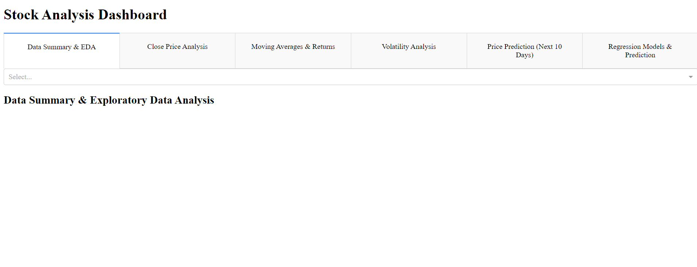
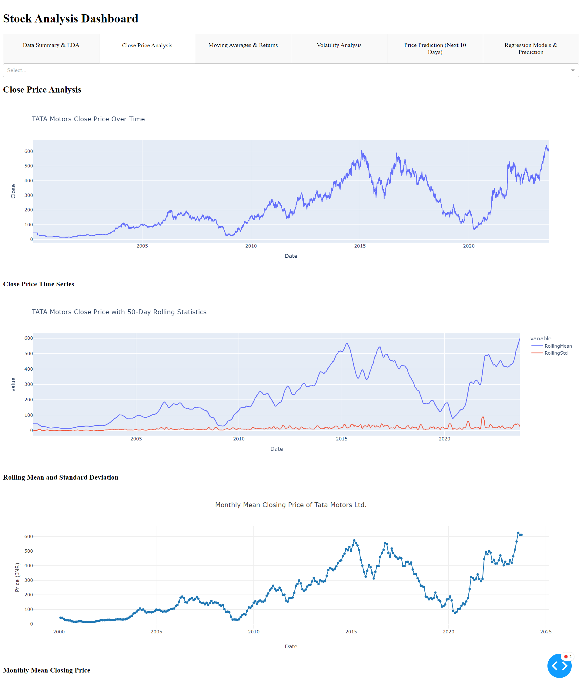
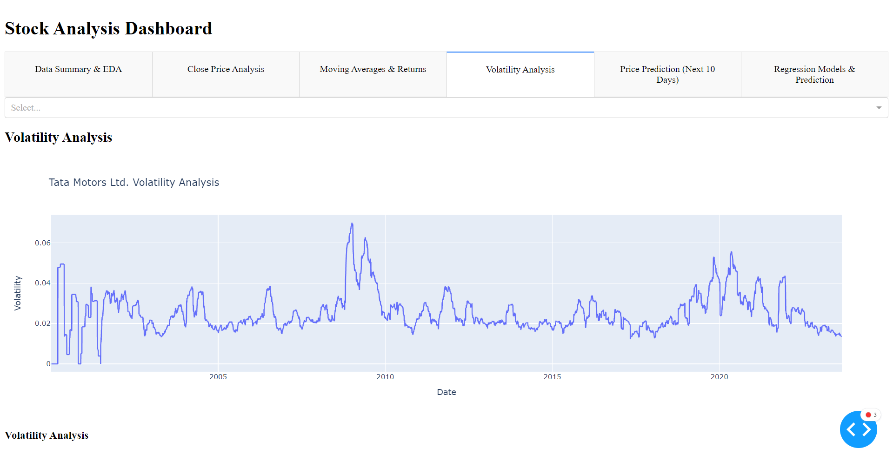
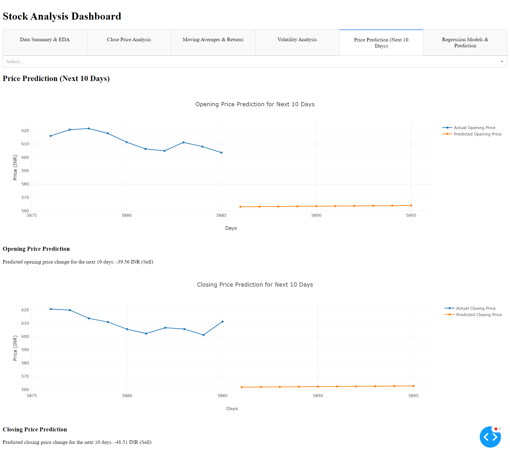
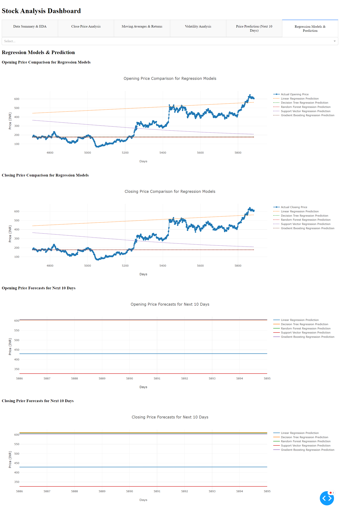

# Stock Analysis Dashboard

The Stock Analysis Dashboard is a Python web application built with the Dash framework. It allows users to perform various analyses on historical stock data and make price predictions using regression models.

## Table of Contents

- [Features](#features)
- [Installation](#installation)
- [Usage](#usage)
- [Screenshots](#screenshots)
- [Contributing](#contributing)
- [License](#license)

## Features

- Data Summary & Exploratory Data Analysis
- Close Price Analysis
- Moving Averages & Returns Analysis
- Volatility Analysis
- Price Prediction for the Next 10 Days
- Regression Models & Prediction

## Installation

1. Clone the repository:

   ```shell
   git clone https://github.com/yourusername/stock-analysis-dashboard.git
   cd stock-analysis-dashboard

Install the required Python packages using pip:
```commandline
pip install -r requirements.txt

```

### Usage

    Run the main.py script to start the Dash application:

```commandline
python csvexport.py
python demo.py

```
# Demo










Access the dashboard in your web browser at http://127.0.0.1:8050/.

Upload a CSV file containing historical stock data to perform analysis and predictions.

# Contributing

Contributions are welcome! If you would like to contribute to this project, please open an issue or submit a pull request.

# License

This project is licensed under the MIT License - see the LICENSE file for details.